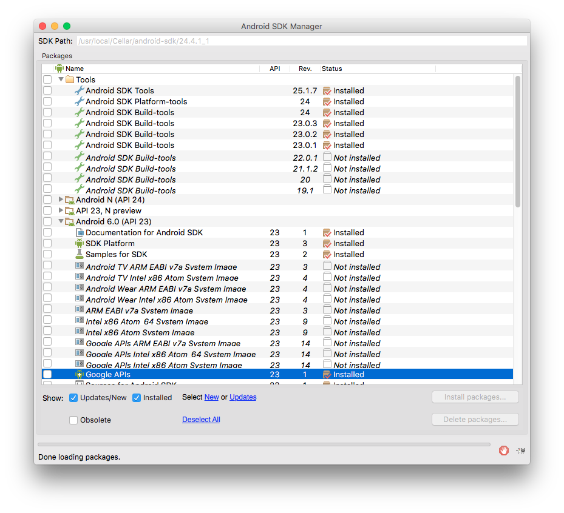
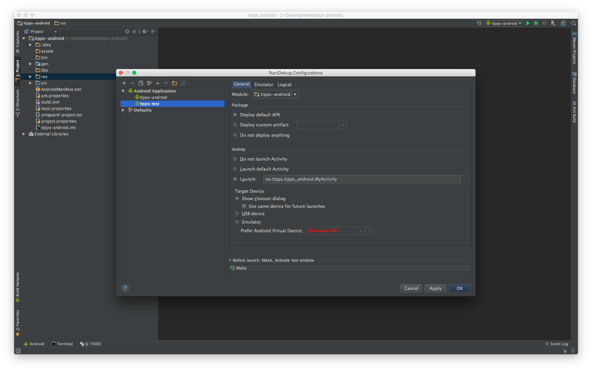

README

1. Install Homebrew: `/usr/bin/ruby -e "$(curl -fsSL https://raw.githubusercontent.com/Homebrew/install/master/install)"`
2. Install Android: `brew install android-sdk`
3. Start Android SDK Manager by running command `android`
4. Installer API 23 det som er valgt her ish 
3. Last ned og installér IntelliJ IDEA: https://www.jetbrains.com/idea/download/download-thanks.html?platform=mac
4. Clone github repo
5. Start IntelliJ - import project: Velg github-repo
6. Vent til indexing og alt er ferdig (kan ta litt tid)
7. Sett opp run configuration 